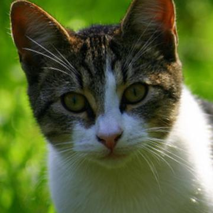
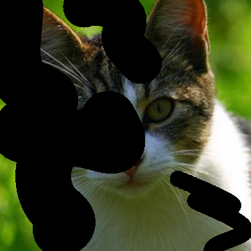
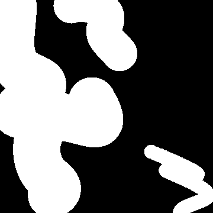
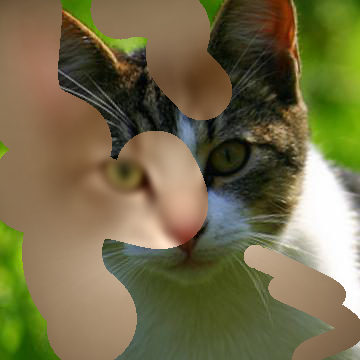

# Missing Data Challenge - with cats 2023

The goal of this challenge is to develop and evaluate algorithms for image inpainting. In this challenge, inpainting is the process of filling in missing parts of an image, where we already know which part that needs to be filled.

In the example below, there is an **original** image that has been *masked* with a **stroke mask** resulting in a **stroke masked** image. The goal is to predict the missing values in the **stroke masked** image, given the mask and the stroked masked image. A simple try on inpainting is shown to the right.

|                 Original                 |                 Stroke Masked                 |                 Stroke Mask                 |                 Inpainted                 |
:----------------------------------------:|:---------------------------------------------:|:-------------------------------------------:|:-----------------------------------------:
|  |  |  |  |

# References

- https://github.com/affromero/NTIRE22_Inpainting
